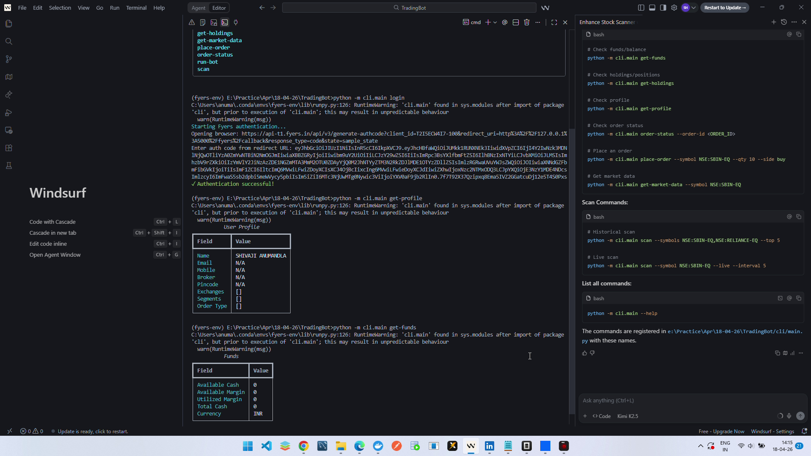
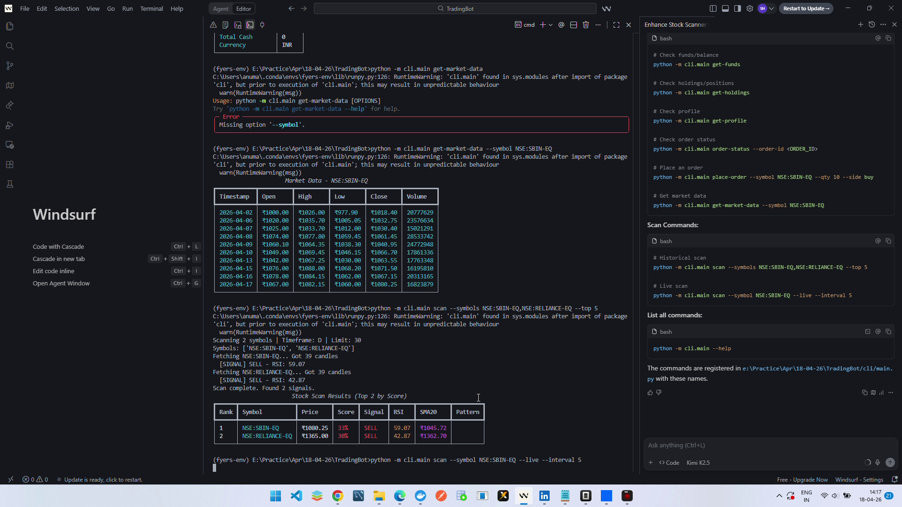

# 🤖 Fyers Trading Bot

[](https://www.python.org/downloads/)
[](https://opensource.org/licenses/MIT)
[](https://github.com/psf/black)

A professional CLI-based algorithmic trading bot for the Indian stock market, powered by the Fyers API. Features multi-stock scanning, live data streaming, pattern detection, and probability-based signal scoring.

## 📸 Demo Screenshots

### Historical Scan Results


### Live Trading Mode


## ✨ Features

- **📊 Multi-Stock Scanning**: Scan single symbols, multiple symbols, or entire index groups (NIFTY50, BANKNIFTY)
- **⚡ Live Data Streaming**: Real-time scanning with configurable polling intervals
- **🎯 Signal Generation**: Strategy-based signals using RSI, SMA, Volume, and Chart Patterns
- **📈 Probability Scoring**: Weighted scoring system (RSI 30%, Trend 30%, Volume 20%, Pattern 20%)
- **🔔 Pattern Detection**: Automatic detection of flags, triangles, and pennants
- **💰 Auto-Trading**: Optional automatic order placement for high-confidence signals (≥75%)
- **🛡️ Risk Management**: Built-in stop-loss, position sizing, and trade limits
- **📱 CLI Interface**: Clean, colorful terminal output with Rich tables

## 🚀 Quick Start

### Installation

```bash
# Clone the repository
git clone https://github.com/yourusername/fyers-trading-bot.git
cd fyers-trading-bot

# Create conda environment
conda create -n fyers-env python=3.9
conda activate fyers-env

# Install dependencies
pip install -r requirements.txt
```

### Configuration

1. Create a `config.ini` file:
```ini
[DEFAULT]
client_id = YOUR_FYERS_CLIENT_ID
secret_key = YOUR_FYERS_SECRET_KEY
redirect_uri = https://127.0.0.1:5000/fyers/login
```

2. Run initial authentication:
```bash
python -m cli.main login
```

## 📖 Usage

### Scan Stocks

```bash
# Scan a single stock
python -m cli.main scan --symbol NSE:SBIN-EQ

# Scan multiple stocks
python -m cli.main scan --symbols NSE:SBIN-EQ,NSE:RELIANCE-EQ,NSE:INFY-EQ

# Scan an entire index (Top 5 by score)
python -m cli.main scan --index NIFTY50 --top 5

# Scan with custom parameters
python -m cli.main scan --index BANKNIFTY --limit 100 --timeframe D
```

### Live Trading Mode

```bash
# Live scan with auto-trading enabled
python -m cli.main scan --symbol NSE:SBIN-EQ --live --auto-trade --threshold 75 --interval 5

# Live scan multiple symbols
python -m cli.main scan --symbols NSE:SBIN-EQ,NSE:RELIANCE-EQ --live --interval 10
```

### Place Orders

```bash
# Market order
python -m cli.main place-order --symbol NSE:RELIANCE-EQ --side BUY --qty 10

# Limit order
python -m cli.main place-order --symbol NSE:SBIN-EQ --side SELL --qty 5 --type LIMIT --price 1080.50
```

### Check Portfolio

```bash
# Check account funds
python -m cli.main get-funds

# Check holdings
python -m cli.main get-holdings

# Check user profile
python -m cli.main get-profile

# Check order status
python -m cli.main order-status --order-id 230415000000001
```

## 📊 Sample Output

### Historical Scan Results
```
Scanning 12 stocks from BANKNIFTY index...
Scan complete. Found 12 signals.

                    Stock Scan Results (Top 5 by Score)
┏━━━━━━┳━━━━━━━━━━━━━━━━━━━┳━━━━━━━━━━┳━━━━━━━┳━━━━━━━━┳━━━━━━━┳━━━━━━━━━━┳━━━━━━━━━━┓
┃ Rank ┃ Symbol            ┃ Price    ┃ Score ┃ Signal ┃ RSI   ┃ SMA20    ┃ Pattern  ┃
┡━━━━━━╇━━━━━━━━━━━━━━━━━━━╇━━━━━━━━━━╇━━━━━━━╇━━━━━━━━╇━━━━━━━╇━━━━━━━━━━╇━━━━━━━━━━┩
│ 1    │ NSE:BANDHANBNK-EQ │ ₹174.47  │ 75%   │ SELL   │ 70.11 │ ₹158.26  │ 📉 100%  │
│ 2    │ NSE:AXISBANK-EQ   │ ₹1359.10 │ 65%   │ SELL   │ 75.30 │ ₹1257.53 │ 📈 53%   │
│ 3    │ NSE:AUBANK-EQ     │ ₹990.60  │ 55%   │ SELL   │ 70.42 │ ₹918.03  │          │
│ 4    │ NSE:BANKBARODA-EQ │ ₹280.44  │ 53%   │ SELL   │ 56.83 │ ₹269.82  │ 📉 93%   │
│ 5    │ NSE:CANBK-EQ      │ ₹142.37  │ 53%   │ SELL   │ 60.34 │ ₹134.60  │ 📉 65%   │
└──────┴───────────────────┴──────────┴───────┴────────┴───────┴──────────┴──────────┘
```

### Live Scan Output
```
Starting live scan for 1 symbols...
Interval: 5s | Press Ctrl+C to stop
Auto-trading ENABLED | Threshold: 75%

Time       Symbol               Price        Score    Signal   Pattern
--------------------------------------------------------------------------------
[14:30:15] [cyan]NSE:SBIN-EQ[/cyan] | Price: [yellow]₹1080.25[/yellow] | [green]82%[/green] | [red]SELL[/red] | 📉 flag (78%)
  → ORDER PLACED | ID: 230415000000012 | Qty: 10 | SL: ₹1058.65
[14:30:20] [cyan]NSE:SBIN-EQ[/cyan] | Price: [yellow]₹1080.10[/yellow] | [green]81%[/green] | [red]SELL[/red] | 📉 flag (77%)
```

## 🏗️ Project Structure

```
fyers-trading-bot/
├── api/                    # API clients and data fetchers
│   ├── __init__.py
│   ├── client.py          # Fyers API client wrapper
│   └── market_data.py     # Historical data and quotes
├── auth/                   # Authentication modules
│   ├── __init__.py
│   └── token_manager.py   # Token management
├── cli/                    # Command-line interface
│   ├── __init__.py
│   ├── main.py            # CLI entry point
│   └── commands.py        # CLI commands
├── strategies/             # Trading strategies
│   ├── __init__.py
│   ├── scanner.py         # Stock scanner with scoring
│   ├── signal_scorer.py   # Probability scoring system
│   ├── pattern_detector.py # Pattern detection
│   ├── order_executor.py  # Auto-trading with risk controls
│   ├── live_engine.py     # Live streaming engine
│   ├── indicators.py      # Technical indicators
│   └── parser.py          # Strategy configuration parser
├── utils/                  # Utilities
│   ├── __init__.py
│   └── helpers.py         # Helper functions
├── config.ini             # Configuration file (create this)
├── strategy.json          # Strategy configuration
├── requirements.txt       # Python dependencies
└── README.md              # This file
```

## ⚙️ Configuration

### Strategy Configuration (`strategy.json`)

```json
{
  "indicators": {
    "rsi": {"period": 14, "overbought": 70, "oversold": 30},
    "sma": {"short": 20, "long": 50},
    "volume": {"spike_threshold": 1.5}
  },
  "entry_conditions": {"rsi_less_than": 30, "volume_greater_than": 100000},
  "exit_conditions": {"rsi_greater_than": 70},
  "default_symbols": ["NSE:SBIN-EQ", "NSE:RELIANCE-EQ", "NSE:INFY-EQ"],
  "timeframe": "D",
  "limit": 100
}
```

### Scoring Weights

The probability scoring system uses the following weights:

| Component | Weight | Description |
|-----------|--------|-------------|
| RSI       | 30%    | Overbought/Oversold conditions |
| Trend     | 30%    | SMA20 vs SMA50 trend direction |
| Volume    | 20%    | Volume spike detection |
| Pattern   | 20%    | Chart pattern confidence |

**Score Thresholds:**
- 🟢 High Confidence: ≥75% (Auto-trading eligible)
- 🟡 Medium Confidence: 50-74%
- 🔴 Low Confidence: <50%

## 🛡️ Risk Management

The bot includes multiple risk controls:

- **Position Sizing**: Configurable percentage of capital per trade (default: 10%)
- **Stop Loss**: Automatic stop-loss calculation (default: 2% from entry)
- **Max Trades**: Daily trade limit (default: 5 trades/day)
- **Max Positions**: Concurrent position limit (default: 3 positions)
- **Score Threshold**: Only trades with score ≥ threshold are executed

## 🧪 Testing

```bash
# Run a test scan (dry mode)
python -m cli.main scan --symbol NSE:SBIN-EQ --limit 50

# Test live mode without auto-trading
python -m cli.main scan --symbol NSE:SBIN-EQ --live
```

## 📝 API Reference

### Available Commands

| Command | Description | Example |
|---------|-------------|---------|
| `login` | Authenticate with Fyers | `python -m cli.main login` |
| `scan` | Scan stocks for signals | `python -m cli.main scan --index NIFTY50` |
| `get-funds` | Check account balance | `python -m cli.main get-funds` |
| `get-holdings` | View portfolio | `python -m cli.main get-holdings` |
| `place-order` | Place a trade | `python -m cli.main place-order --symbol SYM --side BUY --qty 10` |
| `order-status` | Check order status | `python -m cli.main order-status --order-id ID` |

### Scan Options

| Option | Description | Default |
|--------|-------------|---------|
| `--symbol` | Single symbol to scan | - |
| `--symbols` | Comma-separated symbols | - |
| `--index` | Index group (NIFTY50, BANKNIFTY) | - |
| `--timeframe` | Candle timeframe (D, 1h, 5m) | D |
| `--limit` | Number of candles | 100 |
| `--top` | Show top N results | 5 |
| `--live` | Enable live mode | False |
| `--interval` | Polling interval (seconds) | 5 |
| `--auto-trade` | Auto-place orders | False |
| `--threshold` | Minimum score for trading | 75 |

## 🤝 Contributing

Contributions are welcome! Please feel free to submit a Pull Request.

1. Fork the repository
2. Create your feature branch (`git checkout -b feature/AmazingFeature`)
3. Commit your changes (`git commit -m 'Add some AmazingFeature'`)
4. Push to the branch (`git push origin feature/AmazingFeature`)
5. Open a Pull Request

## 📄 License

This project is licensed under the MIT License - see the [LICENSE](LICENSE) file for details.

## ⚠️ Disclaimer

**IMPORTANT**: This trading bot is for educational and research purposes only. 

- **Trading involves substantial risk of loss**: Past performance is not indicative of future results.
- **Test thoroughly**: Always test with paper trading before using real money.
- **No guarantees**: The signals generated are algorithmic and do not guarantee profits.
- **Your responsibility**: You are solely responsible for your trading decisions.
- **Not financial advice**: This bot does not provide financial or investment advice.

By using this software, you acknowledge that you understand these risks and agree to use it at your own risk.

## 📞 Support

For issues and feature requests, please use the [GitHub Issues](https://github.com/yourusername/fyers-trading-bot/issues) page.

## 🙏 Acknowledgments

- [Fyers API](https://myapi.fyers.in/) for market data and trading infrastructure
- [Rich](https://rich.readthedocs.io/) for beautiful terminal formatting
- [Typer](https://typer.tiangolo.com/) for CLI framework

---

**Happy Trading! 📈**
